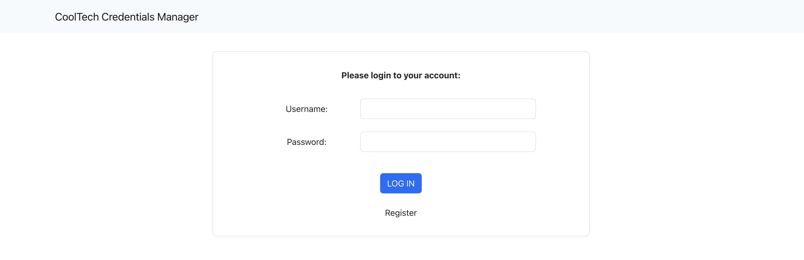
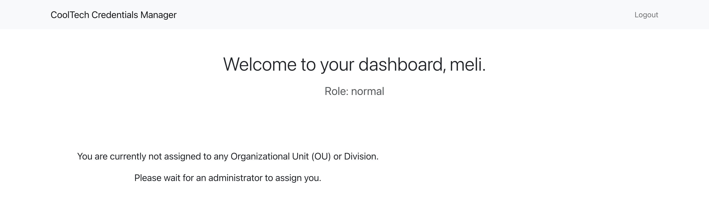
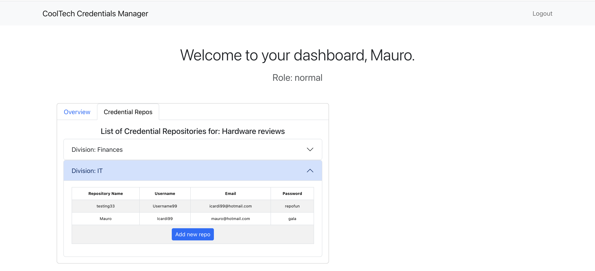
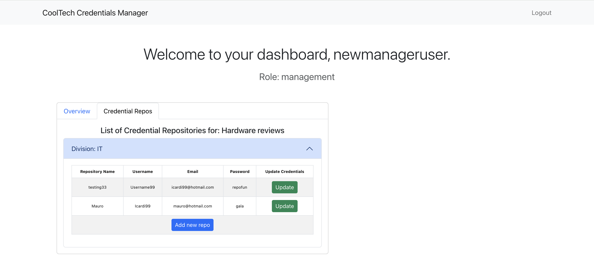
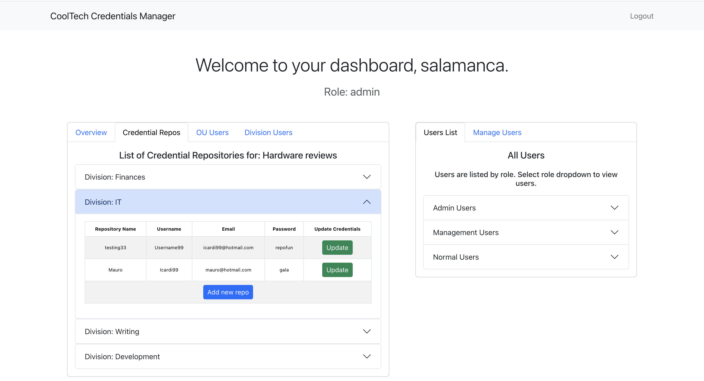

# Cool Tech Credential Management App

## Table of Contents

- [Description](#description)
- [Example of Dashboards](#Example-of-Dashboards)
- [Features](#features)
- [Technologies Used](#technologies-used)
- [Prerequisites](#prerequisites)
- [Installation](#installation)
- [Launching the App](#launching-the-app)
- [API Endpoints](#api-endpoints)
- [Usage](#usage)
- [Components](#components)
- [Creator](#creator)

## Description

The Cool Tech Credential Management App is an internal web application built to securely manage login credentials for various services like websites, servers, and financial accounts. The app provides user authentication, role-based access control, and resource access management to ensure that only authorized users can view, add, or update credentials based on their assigned roles. The app is structured around Organisational Units (OU), each containing several Divisions, and every division has its own credential repository.

The web app is designed with high security in mind due to the sensitive nature of the credentials stored, ensuring that only authenticated users can interact with the data.

### Authentication & Core/Crud Features

- **User Authentication & Registration:** New users are automatically assigned a default role of "Normal" upon registration.

- **Role-based Dashboard Access:** The content displayed on the dashboard depends on the user's role, ensuring they only see the resources they are permitted to access.

- **View Organisational Units (OUs), Divisions, and Credential Repositories:** Users can view the OUs, divisions, and credential repositories they are assigned to.

- **Add Credentials:** Users can add new credentials to the relevant repository based on their role (Normal, Management, Admin).

- **Update Credentials:** Users with Management or Admin roles have the ability to modify existing credentials in the repository.

- **Manage Users in OUs and Divisions:** Admin users can assign or unassign other users from OUs and divisions.

- **Role Management:** Admin users have the authority to change the roles of any user.

## Example of Dashboards

- **Log in or Register:**
  

- **New registered user with no access to any OU or Division**
  

- **Normal Dashboard user and assigned to OU:**
  

- **Management Dashboard user and assigned to OU:**
  

- **Admin Dashboard user with full view access to everything and can also change user roles/unassign users/add users to OU's and Division's/ and much more:**
  

## Features

- **User Registration and Login:** New users can register and log in using secure authentication.
- **Role-Based Access Control:**
- **Normal Users:** Can view and add credentials to the repository.
- **Management Users:** Can view, add, and update credentials.
- **Admin Users:** Full control—view, add, update credentials, assign/unassign users to divisions and OUs, and change user roles.
- **Organisational Structure:**
- **4 Organisational Units (OUs):** News management, Software reviews, Hardware reviews, Opinion publishing.
- Over 10 Divisions per OU, managing different tasks like finance, IT, writing, development, etc.
- **Credential Repository:** Each division has its own list of login credentials that employees can access.
- **User Role Management:**: Admins can assign or unassign users from OUs and divisions and change their roles.
- **Add, Edit, and Delete Credentials:** Users can manage login credentials based on their role.
- **Responsive UI:** The app has a clean and user-friendly interface that is responsive across devices.

## Technologies Used

- Frontend: React.js, Bootstrap for UI components
- Backend: Node.js, Express.js
- Database: MongoDB (with Mongoose ODM)
- Authentication: JSON Web Tokens (JWT)
- Security: bcrypt for password hashing, Helmet for securing HTTP headers, CORS for secure cross-origin requests
- Toast Notifications: react-toastify for user-friendly notifications

## Prerequisites

Before you begin, ensure you have the following installed on your system:

- [Node.js](https://nodejs.org/) (version 14.x or later)
- [MongoDB] Atlas account (or a local MongoDB instance)
- [npm](https://www.npmjs.com/) (version 6.x or later)
- [Git](https://git-scm.com/)
- A `.env` file set up in the `server` directory.

## Installation

To install and run the application locally:

### Setup Instructions

1. Clone the repository:

   ```bash
   git clone https://github.com/M311HAN/cooltech-credential-management..git
   cd cooltech-credential-management
   ```

2. Navigate to the project directory:

   ```bash
   cd credential-management
   ```

3. Install the dependencies:

   ```bash
   # Install server-side dependencies
   cd server
   npm install
   ```

4. ```bash
   # Install client-side dependencies
   cd client
   npm install
   ```
5. Create a `.env` file to store your MongoDB connection string:

```bash
MONGO_URI=your-mongo-db-connection-string
JWT_SECRET=your-jwt-secret-key
```

```bash
MONGO_URI=mongodb+srv://<username>:<password>@cluster.mongodb.net/maintenance
```

## Launching the App

### Running the Backend Server

1. Navigate to the server directory:

   ```bash
   cd server
   ```

2. Start the server-side with nodemon:
   ```bash
   npm run dev
   ```

The server should now be running on `http://localhost:3001`.

### Running the Frontend

1. Navigate to the client directory:

   ```bash
   cd client
   ```

2. Start the React app:
   ```bash
   npm start
   ```

The frontend should now be running on `http://localhost:3000`.

## API Endpoints

- **Authentication**
- `POST /login:` Authenticate users and generate JWT token.
- `POST /register:` Register a new user.

- **Organisational Units & Divisions**
- `GET /organisational-units:` Retrieve all OUs and divisions the user has access to.
- `PUT /assign-user:` Admin can assign users to OUs and divisions.
- `PUT /unassign-from-ou:` Admin can unassign users from OUs.
- `PUT /unassign-from-division:` Admin can unassign users from divisions.

- **Credential Repositories**
- `POST /add-credential-repo:` Add a new credential to a division’s repository.
- `PUT /update-credential-repo:` Update an existing credential in a division’s repository.

- **Users**
- `GET /users:` Admin can retrieve all users.
- `PUT /change-user-role:` Admin can change a user’s role.

## Usage

- `Login or Register:` New users can sign up, and existing users can log in with their credentials.

- `View Credentials:` Based on their role, users can view credentials of the divisions they are part of.

- `Add or Edit Credentials:` Normal and Management users can add new credentials, while management can also edit them.

- `Assign and Unassign Users (Admin only):` Admins can assign/unassign users to different OUs and divisions.

- `Change User Roles (Admin only):` Admins can update the roles of other users.

## Components

### Frontend

- **App.js:**: Main entry point for the application.
- **Login.js:**: Handles user login functionality.
- **Dashboard.js**: Displays the dashboard after a successful login.
- **HeaderNavbar.js**: Displays the navigation bar.
- **OuCard.js**: Displays the list of OUs and divisions.
- **AddRepoForm.js**: Form for adding new credentials.
- **EditRepoForm.js**: Form for editing existing credentials.
- **UsersCard.js**: Admin functionality for managing users, roles, and OUs.

### Backend

- **index.js**: Main entry point for the backend. Sets up the Express server, middleware (like Helmet for security, CORS, etc.), and defines all routes for the application.
- **user.controller.js**: Handles user-related functionality including login, registration, fetching users, and changing user roles.
- **organisationUnit.controller.js**: Manages the organizational units (OUs), divisions, and credential repositories. Handles adding, updating, and unassigning users to/from OUs and divisions, and managing credential repositories.
- **verifyToken.js**:Middleware that verifies JWT tokens for protected routes.
- **user.js**:Defines the user schema and model for MongoDB, including username, password, and role.
- **organisationUnit.model.js**:Defines the schema and model for organizational units, including divisions and credential repositories.
- **credentials.model.js**:Schema for storing credential information within divisions.

### Technical Details:

- **Mongoose Integration**: The application utilizes Mongoose to connect to a MongoDB database, allowing for seamless data storage and retrieval. Mongoose models are used to define the structure of the job documents in the database, ensuring data integrity and consistency.
- **Database Connectivity**: The backend is connected to a MongoDB Atlas cluster, enabling secure and scalable data management. All job-related data is stored in this database, making it accessible from anywhere and ensuring reliability.

## Technologies Used

- **Frontend**:
- React.js
- Bootstrap for UI components
- Jest for testing

- **Backend**:
- Node.js with Express.js for the server
- MongoDB with Mongoose for the database
- Helmet for security
- Cors for cross-origin resource sharing
- Postman for testing

### Setting Up the .env File

Create a `.env` file to store your MongoDB connection string inside of the server directory where the `app.js` file is located.

```bash
MONGO_URI=mongodb+srv://<username>:<password>@cluster.mongodb.net/maintenance
```

Then install the `dotenv` package to help load environment variables from `.env` files:

```bash
npm install dotenv
```

## Creator

This project is created by Melihhan (https://github.com/M311HAN). [Visit the repository](https://github.com/M311HAN?tab=repositories) for more projects and further collaboration.
